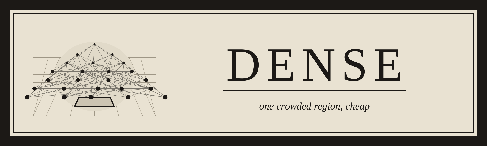
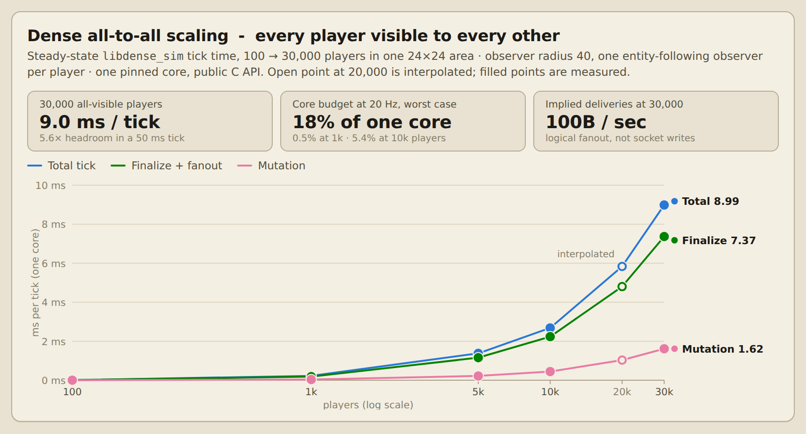
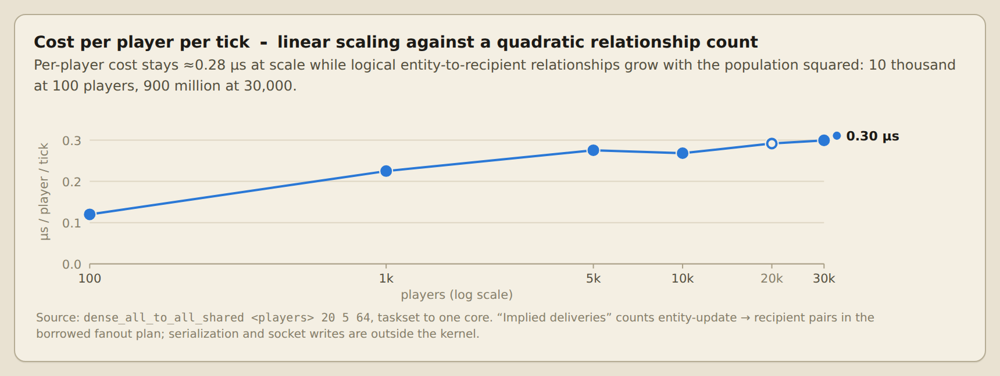
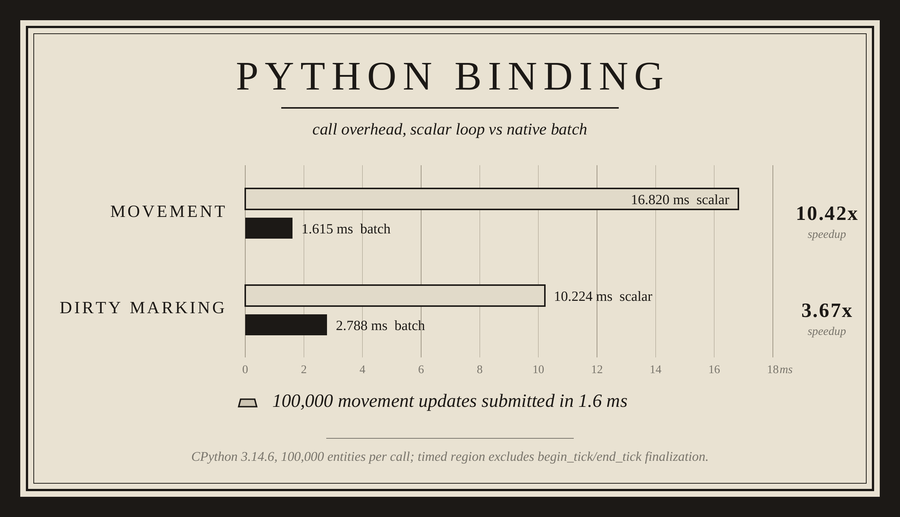

<p align="center">
  
</p>

# Dense 0.2.0

**A high-density multiplayer server library family in C.**

Dense is a family of deterministic multiplayer server libraries that remain
efficient when large numbers of players, NPCs, projectiles, timers, paths,
collision bodies, and replication recipients gather in the same area.

Dense is not a complete game server. It provides explicit modules for
simulation, transport, scheduling, collision, navigation, AI, and durable
state. This package contains the prebuilt Linux x86-64 libraries, public
headers, documentation, and binding source. Core implementation source is not
included; the Python, C++, and Rust bindings ship with their full source.

## What is new in 0.2

Dense 0.1 shipped two libraries: `libdense_sim` and DenseDB. Dense 0.2
completes the MMO stack. Five new libraries join the family, and every
library now runs behind one shared overload ladder inside a deterministic,
record/replayable authority loop:

- `libdense_net` - sessions, reliability, and replication transport
- `libdense_sched` - tick phases, timers, budgets, and overload control
- `libdense_collision` - authoritative integer collision and movement validation
- `libdense_nav` - deterministic pathfinding, flow fields, and hierarchy
- `libdense_ai` - deterministic agent perception, behavior, and intents

The private `dense_core` primitive layer (maps, dirty sets, arenas, slot
pools, span hashing, CPU dispatch, integer sorting) is statically merged into
each shipped library with hidden visibility; it is not a separate artifact.

## Modules

| Module | Responsibility |
|---|---|
| `libdense_sim` | Entity lifecycle, validated positions, spatial membership, dirty state, and canonical fanout views |
| `libdense_net` | Sessions, transport, reliability, queueing, and replication transport that consumes simulation fanout |
| `libdense_sched` | Tick phases, timing wheel, budgets, fairness, token buckets, and the shared overload ladder |
| `libdense_collision` | Authoritative integer collision, broadphase, movement validation, queries, and triggers |
| `libdense_nav` | Sparse navigation grids, deterministic paths, flow fields, caches, and collision rasterization |
| `libdense_ai` | Deterministic agent memory, behavior trees, scheduler-sliced execution, and intent production |
| `densedb` | Single-writer state tables, WATCH views, WAL durability, snapshots, and recovery |

## Authority and dependency direction

```text
dense_core (private, statically merged into each library)
    ^
    |-- libdense_sim
    |-- libdense_net
    |-- libdense_sched
    |-- libdense_collision
    |-- libdense_nav
    |-- libdense_ai
    `-- DenseDB
```

The intended server pipeline is:

```text
input
  -> validate
  -> nav proposal
  -> collision validation
  -> simulation commit
  -> combat / AI intent processing
  -> simulation fanout
  -> network flush
  -> DenseDB flush seam
```

`libdense_sim` is the sole authority for replication grouping. `libdense_net`
consumes borrowed fanout views and does not independently scan entities or
decide visibility groups. AI produces intents rather than mutating
authoritative game state directly.

## Benchmarks

All numbers below are from the 0.2.0 full benchmark run recorded on
2026-07-28 on an AMD Ryzen 5 5600X (Linux x86-64, release `-O3` build).
The raw log ships in this package at
`release/benchmarks/benchmark_full_Ryzen_5600x_7.28.26.txt`, and
`docs/BENCHMARK-SCOPE.md` defines which claims are retained. Benchmarks are
single-threaded unless stated; Dense targets a deterministic single-writer
tick.

<p align="center">
  
</p>
<p align="center">
  
</p>

### Integrated authority loop

The deterministic 240-tick authority harness runs every module in one
pipeline (input, validate, spatial, combat, AI, fanout, flush) with
record/replay checksums pinned across release and ASan/UBSan builds.

| Tick latency | Time |
|---|---:|
| p50 | 14.3 us |
| p95 | 20.9 us |
| p99 | 56.7 us |
| max | 248.1 us |

Representative simulation gate scenarios (`release/benchmarks/rc-gate.txt`):

| Scenario | Tick time |
|---|---:|
| 1,000 entities, dense shared cell | 0.207 ms |
| Town: 100,000 entities, 1,000 observers | 0.112 ms |
| 1,000 observers crossing chunk boundary | 4.183 ms |
| 64-way type-mask fragmentation | 0.813 ms |

### libdense_sim

| Benchmark | Result |
|---|---:|
| Spawn with spatial insertion (1M entities) | 4.72 M entities/s |
| Entity lookup (1M entities) | 48.5 M lookups/s |
| Same-cell movement (100k entities) | 39.4 M moves/s |
| Chunk-boundary thrash (20M crossings) | 11.8 M moves/s |
| Dirty mark, public first-mark (1M entities) | 29.9 M marks/s |
| Dirty mark, direct slot | 278.5 M marks/s |
| Next-tick dirty reset | 772.9 M entities/s |
| Fanout plan, shared recipient set (1M implied deliveries/tick) | 0.055 ms/tick |
| Observer boundary shift (10k observers, 12 chunk edges each) | 5.14 ms/tick |
| Kinetic motion, stable plans vs sampled baseline | 0.57x cost |

### libdense_net

| Benchmark | Result |
|---|---:|
| Replication publish (encode + refs, 65,536 recipient-frames/tick) | 10.7 ns/frame |
| Session flush | 12.7 ns/frame |
| Shared fanout vs per-recipient naive sends | 1.66x faster |
| Implied deliveries | 85.3 M/s |
| Session lookup (5,000 sessions) | 5.9 ns/op |
| Flush-all visit cost (5,000 sessions) | 118.7 ns/session |
| Batch frame encode vs scalar | 1.27x faster |
| Adverse soak: 20% drop, 8% dup, 12% reorder | 20,000/20,000 reliable commands in order |

### libdense_sched

| Benchmark | Result |
|---|---:|
| Timer schedule (1M timers) | 8.1 ns/op |
| Timer cancel | 12.3 ns/op |
| Advance + fire | 66.0 ns/fired timer |
| Named 7-phase pipeline telemetry | 99.4 ns/tick |
| Overload scenario (18 ms offered vs 10 ms budget) | worst tick 14.25 ms, 13/13 escalations recovered |

### libdense_collision

| Benchmark | Result |
|---|---:|
| Validated move (slide + bodies + commit + triggers, 2,000-body crowd) | 241 ns/move (4.14 M moves/s) |
| Swept circle vs 400 statics + 1,500 bodies, 46.7% hit rate | 772 ns/sweep (1.30 M sweeps/s) |

### libdense_nav

| Benchmark | Result |
|---|---:|
| Raw A* (256x256, ~22% walls) | 1,368 us/path |
| Cached dense path reuse (96.2% hit rate) | 53.7 us/path |
| Line of sight vs full A* on close requests | 29.3 ns vs 880.6 ns (30.0x) |
| Bounded 300-request repath lane vs unbounded drain | 2,570x smaller peak burst |
| Hierarchical long route (512x512) vs full tile A* | 0.017 ms vs 63.9 ms (3,759x fewer tile expansions) |
| Flow-field crowd steering (10k agents) | 9.1 ns/agent-step |
| Batch APIs (cost, LOS, flow sample) | 1.07-1.14x vs scalar |

### libdense_ai

| Benchmark | Result |
|---|---:|
| Horde: perceive + threat + tree + intent (10k agents, one tree) | 83 ns/agent-tick |
| Whole-horde tick (10k agents) | 0.83 ms |
| Scheduler slicing (250 to 10,000-agent slices) | equal total cost across slice sizes |
| Batch condition checks vs scalar | 1.48x faster |

### DenseDB

| Benchmark | Result |
|---|---:|
| Direct hp SoA column scan (100k rows) | 0.032 ms |
| Vitals u16 column update (100k rows) | 13.97 ms mean |
| WATCH churn finalization (120,000 deltas/tick) | 6.21 ms/tick |
| WAL commit, no sync (1,000 updates/tick) | 0.149 ms mean |
| Write-behind seal vs synchronous end-tick | 38.7 us vs 617.3 us (15.96x) |
| Snapshot + WAL recovery (10k rows, 100 update ticks) | 124.5 ms |

### Overload ladder

One tuned controller drives input admission, replication volume, AI agent
budgets, navigation expansion, region admission, database flush, and the
emergency tick period through the deterministic authority loop
(`release/benchmarks/overload-tuning.txt`):

| State | Enter/recover (ms) | Input/tick | Repl KiB/tick | AI agents | Nav expansions | Tick period |
|---|---:|---:|---:|---:|---:|---:|
| normal | - | 2,000 | 3,906 | 10,000 | 200,000 | 50.0 ms |
| elevated | 16/12 | 2,000 | 3,320 | 7,500 | 150,000 | 50.0 ms |
| high | 18/14 | 1,500 | 2,344 | 5,000 | 100,000 | 50.0 ms |
| critical | 20/16 | 1,000 | 1,367 | 2,500 | 50,000 | 50.0 ms |
| emergency | 25/18 | 500 | 781 | 1,000 | 20,000 | 62.5 ms |

The controller itself costs 52.9 ns/observation. Under a scripted 3x
overload the ladder escalates in 6 ticks, recovers in order, and returns to
normal without state flapping.

<p align="center">
  
</p>

## Package layout

```text
dense-0.2.0/
|-- README.md, CHANGELOG.md, VERSION, MANIFEST.md
|-- LICENSE.md, COMMERCIAL-LICENSE.md, SECURITY.md, SUPPORT.md
|-- install.sh, uninstall.sh, verify-release.sh, SHA256SUMS
|-- include/dense/          public C headers (9)
|-- lib/linux-x86_64/       shared + static libraries (7)
|-- pkgconfig/              pkg-config templates
|-- bindings/               Python, C++, and Rust wrappers (full source)
|-- docs/                   documentation and per-module references
|-- release/                ABI/API snapshots and benchmark records
`-- densebench/             benchmark charts
```

## Install

Verify and install the precompiled native SDK:

```bash
./verify-release.sh
sudo ./install.sh
```

Selected options (see `docs/INSTALLATION.md` for staging and packaging):

```bash
sudo ./install.sh --prefix /opt/dense
./install.sh --prefix /usr --destdir "$PWD/stage"
sudo ./uninstall.sh --prefix /opt/dense
```

Link with pkg-config:

```bash
pkg-config --cflags --libs libdense_sim
pkg-config --cflags --libs libdense_net
pkg-config --cflags --libs libdensedb
```

## Bindings

Binding source ships in full under `bindings/`; see `docs/BINDINGS.md`.

- **Python**: prebuilt CPython 3.13 and 3.14 Linux x86-64 wheels in
  `bindings/python/dist/`, statically containing `libdense_sim`.
  `python3.14 -m pip install bindings/python/dist/*cp314*.whl`
- **C++**: header-only C++20 wrapper; `make -C bindings/cpp test`
- **Rust**: dependency-free wrapper crate; `make -C bindings/rust test`

<p align="center">
  
</p>

## Determinism and memory policy

Dense targets a deterministic server as a function of initial state, ordered
inputs, configuration, and library versions. The 0.2 release was gated on a
240-tick record/replay harness with per-tick checksums pinned across `-O3`
and ASan/UBSan builds, plus lifecycle and raw-frame audit logging
(`docs/determinism.md`, `docs/replay-and-audit.md`).

Live tick paths are prewarmed and retain high-water memory. A post-prewarm
growth operation is treated as a steady-state allocation and must be
observable in metrics and standing tests (`docs/performance-policy.md`).

## Documentation

Start at `docs/README.md`. Highlights:

- `docs/INSTALLATION.md` - native install, staging, and linker setup
- `docs/mmo-integration.md` - assembling the modules into one server loop
- `docs/architecture.md` - module boundaries and the authority pipeline
- `docs/modules/` - per-library reference notes
- `docs/BENCHMARK-SCOPE.md` - retained performance claims and exclusions
- `docs/PLATFORM-COMPATIBILITY.md` - Linux, glibc, and ABI details

## License

See `LICENSE.md`, `COMMERCIAL-LICENSE.md`, and `SECURITY.md`. Binary
redistribution remains subject to the distribution conditions in
`LICENSE.md`.
