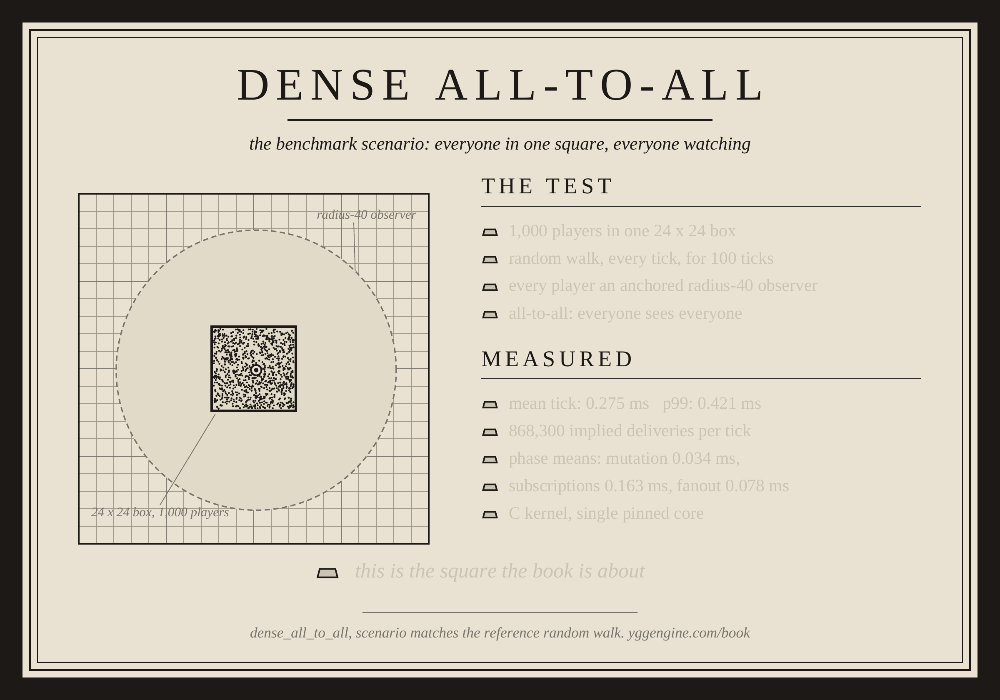
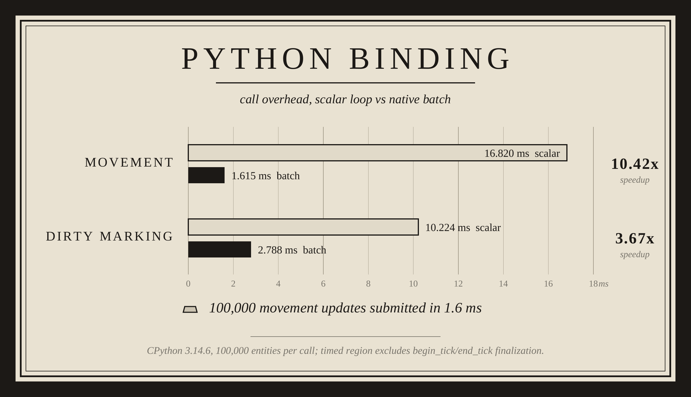
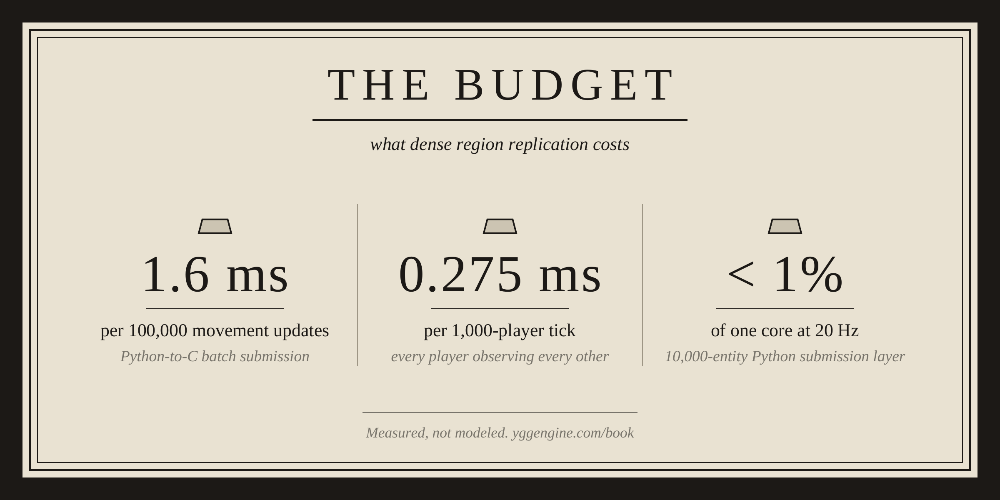

# dense-sim Python binding

This CPython extension wraps the canonical `libdense_sim` C ABI. Spatial
indexing, subscriptions, kinetic scheduling, and fanout grouping remain inside
the native library.

## Pypi Installation

Install Dense from PyPI:

```bash
python3 -m pip install "dense-sim==0.1.0rc1"
```

Because `0.1.0rc1` is a release candidate, installing the package without specifying a version may require the `--pre` option:

```bash
python3 -m pip install --pre "dense-sim"
```

Verify the installation:

```bash
python3 -c "import dense_sim; print(dense_sim.__version__)"
```

Expected output:

```text
0.1.0rc1
```

## Or install by the prebuilt wheel

```bash
python3.13 -m pip install dist/*cp313*.whl
python3.14 -m pip install dist/*cp314*.whl
```

The wheels target Linux x86-64 and statically contain `libdense_sim`.

## Build from the included binding source

From the repository root:

```bash
make -C bindings/python PYTHON=python3.14 test
make -C bindings/python PYTHON=python3.14 wheel
```

The build uses `include/dense/dense_sim.h` and
`lib/linux-x86_64/libdense_sim.a` by default. Override them with:

```text
DENSE_SIM_INCLUDE_DIR
DENSE_SIM_LIB_DIR
DENSE_SIM_STATIC_LIBRARY
```

## Scalar use

```python
from dense_sim import CHANNEL_POSITION, World

world = World(cell_size=8, chunk_size=16)
world.begin_tick(1)
world.spawn(193, 100, 100, 1)
world.move(193, 101, 100)
world.mark_dirty(193, CHANNEL_POSITION)
world.end_tick()

for group in world.fanout_view():
    for delta in group.entries:
        print(delta.entity_id, delta.operation_name)
```

## Batch use

```python
from array import array

entity_ids = array("Q", [193, 228, 482])
xs = array("i", [101, 88, 52])
ys = array("i", [100, 90, 61])

world.move_many(entity_ids, xs, ys)
world.mark_dirty_many(entity_ids, CHANNEL_POSITION)
```

Batch calls are sequential rather than transactional. Borrowed fanout objects
are invalidated by the next successful `World.begin_tick()` or `World.close()`.

## Python Benchmarks

<p align="center">
  
</p>

<p align="center">
  
</p>

<p align="center">
  
</p>
